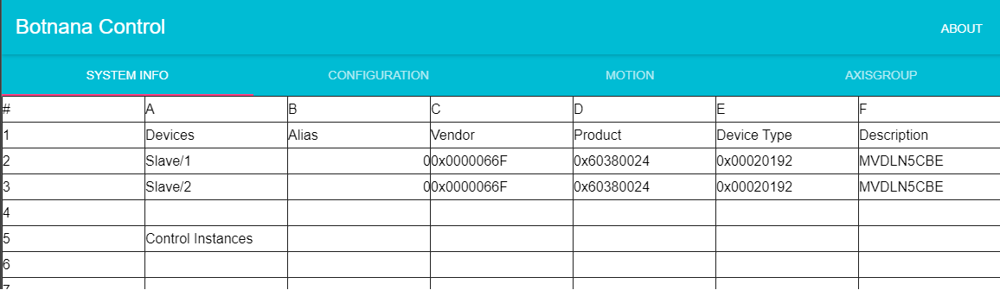
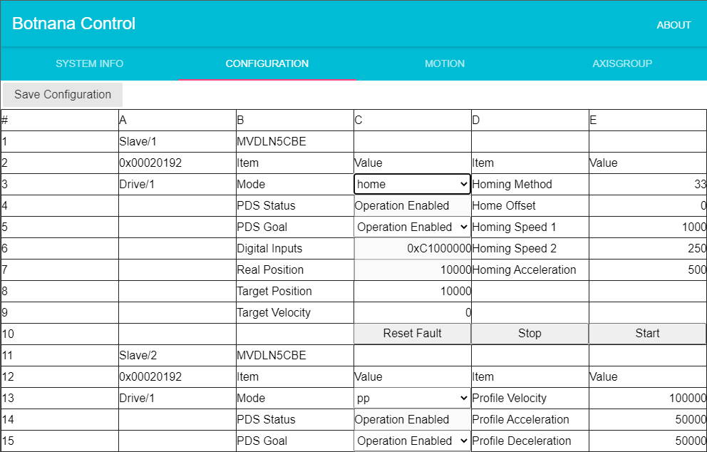
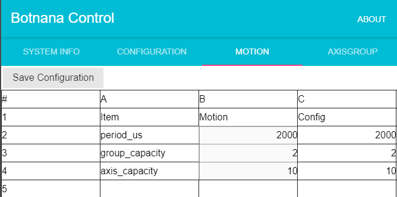
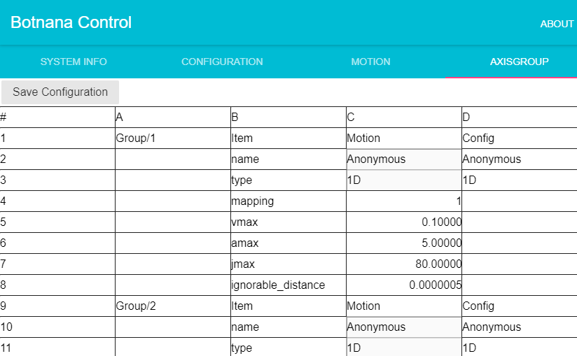
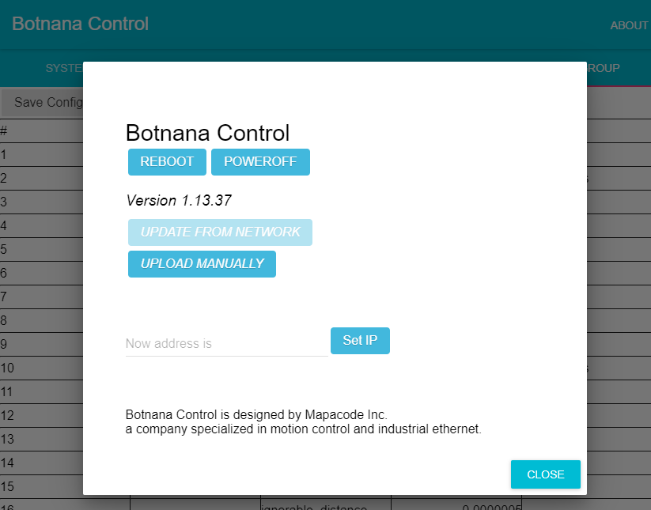

# 設定和測試 (Configuration)

Botnana B2A 會在開機時掃描並初始化從站，因此應在供電前接好從站再供電。

以下是開機的時序，

1. 開機後約 15-18 秒，從站的 EtherCAT 燈號開始閃爍，代表主站已經連上從站。
2. 開機後約 35 秒，主站對從站進行初始設定。
3. 初始設定時間和從站數有關，以及初始設定過程中發生的錯誤重試次數有關。

開機過程中 Botnana B2A 會配發一個 Ethernet IP 地址給上位電腦，這個 IP 地址可以透過上位電腦的工具查到。

* 當上位電腦是 Linux 時，使用 `hostname -I` 可以顯示上位電腦所有的 IP 地址。
* 當上位電腦是 Windows 時，可使用  Control Panel 內的 Network and Sharing Center 下的 View network connections，View status of connection 選項來顯示上位電腦的 IP 地址。

由 Botnana B2A 配給上位電腦的 IP 地址就可以知道 Botnana B2A 建立的區載網的網域，以及 Botnana B2A 的網址。Botnana B2A 本身出廠預設 IP 地址是 192.168.7.2，網域是 192.168.7.0/24。如果 Botnana B2A 的網域被修改為
192.168.6.0/24，則 Botnana B2A 的 IP 地址是 192.168.6.2。以下說明中會使用預設的網址 192.168.7.2。若要修改
Botnana B2A 的 IP 地址請見本章「版本、IP 地址、開關機及更新」一節。修改網域使得上位電腦可以連結多台 Botnana B2A。

開機過程中會同時起動以下三個伺服器和上位電腦通訊：

* 網頁(Http)伺服器。提供網頁。預設網址為 http://192.168.7.2:3000。
* Websocket 伺服器。預設網址為 ws://192.168.7.2:3012。提供比 HTTP 更有效率的全雙工 TCP 通訊。用於下命令給 EtherCAT 主站。命令的協定請見 Botnana Control 程式手冊。
* SSH 伺服器。預設網址為 ssh://192.168.7.2:22。上位電腦可以以 SSH 客戶端透過此一 SSH 伺服器進入 Botnana B2A 的 Linux 系統。登入的使用者名稱是 debian，密碼是 temppwd。若上位系統為 Linux 系統，可以使用 `ssh debian@192.168.7.2` 登入。若上位電腦為 Windows，可以使用 PuTTY 或類似軟體登入。

若上位系統為 Linux，不需特別處理就連上以上三個伺服器。若上位系統為 Windows，請依本手冊後的「常見問題」中的說明，對系統進行修改，才能以 Windows 的內建 RNDIS 驅動程式識別出 Botnana B2A。

當以瀏覽器連結 Botnana B2A 時，若無法連結上，代表網頁伺服器尚未啟動。連結上並出現網頁以及請等待伺服器字樣，代表網頁伺服器已啟動，但尚未完成從站初始設定。當完成從站初始設定後，會出現以下畫面，以預設網址 http://192.168.7.2:3000 為例，

畫面的最上端有四個按鈕，右上方另有一個按鈕，以下簡單說明各按鈕對應的頁面。

* SYSTEM INFO：顯示從站的清單。
* CONFIGURATION：顯示各從站的設定值，並可在此修改各從站的初始設定。
* MOTION：顯示主站的參數。包括取樣週期和支援的軸數 (Axis) 及軸組 (Axis group)。在 Botnana B2A 的術語中，Axis 和軸組是用在需要進行補間的場合。驅動器 (Drive) 則用於非補間的場合。
* AXISGROUP：顯示各個軸組和各個軸的參數，以及各個軸對應的驅動器。
* ABOUT：顯示系統的版號、IP 位址。並可於此進行關機重開或更新軟體。

以下各節說明各頁面的內容。

## 系統資訊

本畫面顯示連線中的 EtherCAT 從站。以下是表中各欄的說明，

* Devices 欄中 Slave 後的數字是依 EtherCAT 網路連線次序計算的站號，EtherCAT 的術語是 Position。
* Alias 欄中則是使用指輪或是其他方式設定的站號，EtherCAT 的術語是別名(Alias)。數字 0 代表未設別名。這欄位是可以修改的。
* Vendor 欄是 EtherCAT 組織配給此一從站的製造商的識別碼(Vendor ID)。
* Product 欄是此一從站的製造商配給此一從站的產品編號(Product Code)。
* Device type 欄是此一從站的裝置型別。0x00020192 代表此為一驅動器。
* Description 欄是此一從站中對此一產品的說明。

## 從站參數設定及測試

在 CONFIGURATION 頁面可以測試從站並且進行從站的參數設定。修改參數會立刻生效。但是不會寫入 Botnana B2A 的設定檔中。要點左上方的 SAVE CONFIGURATION 按鈕才會將參數寫入設定檔中，並於下次開機進行初始設定時從設定檔讀取參數，寫入至從站。

### 驅動器的參數設定以及測試

當從站為 EtherCAT 驅動器時，Botnana B2A 支援 hm、pp、pv、tq、csp、csv、cst 模式，上圖為切換到 home、也就是 hm 模式時的畫面。其中的 mode 是目前的驅動器模式。之下的 PDS Status 是目前驅動器的狀態。有以下幾種狀態：

* Not ready to switch on
* Switch on disabled
* Ready to switch on
* Switched on
* Operation enabled
* Quick stop active
* Fault reaction active
* Fault

針對最重要的幾個狀態說明如下，

* Switched on disabled - 正常開機後，驅動器會進入此狀態後等待程式下命令切換至其他狀態。
* Operation enabled - 這是相當於傳統軸卡的 Servo on 的狀態，在此狀態下馬達被激磁。
* Quick stop active - 這是下了緊急停止後進入的狀態。
* Fault - 這是有異警時進入的狀態。要清除異警請按下方的 Reset Fault 按鈕。

透過 PDS Status 下方的 PDS Goal 可以選擇想要進入的目標狀態，Botnana B2A 會自動切換驅動器狀態到目標狀態。不過，如果發生異警，狀態為 Fault 時，必須使用下方的 Result Fault 按鈕來清除異警，才能切換狀態。如果無法清除異警，請檢查驅動器的異警號碼並排除異警。

在 PDS Goal 下方的 Digital Inputs 將驅動器的輸位輸入以十六進位顯示。請查詢驅動器手冊以瞭解每個位元對應的輸入。

在 Digital Inputs 下方的 Real Position 顯示目前編碼器的數值，在 EtherCAT 文件中稱此為 Actual position。

以下各節說明常用的 hm、pp、pv 模式的參數設定和測試。

### 驅動器 HM 模式設定及測試

上圖是 hm 模式的頁面。在 B 欄中的 mode 右方一格可以選擇要使用的模式，而目前的選擇是 home，也就是 hm 模式。當選擇 hm 模式時，在右方會出現 hm 模式的參數。說明如下，

* Homing method - 回原點的方式。請參考驅動器的手冊以瞭解驅動器支援的回原點方式。
* Homing offset - 原點偏移量，單位為 pulse，也就是編碼器的刻度。
* Homing speed 1 - 回原點的第一段速度。單位為 pulse/s。
* Homing speed 2 - 回原點的第二段速度。單位為 pulse/s。
* Homing acceleration - 回原點的加減速，單位為 pulse/s^2。

### 驅動器 PP 模式設定及測試

### 驅動器 PV 模式設定及測試

## 運動控制參數設定

TODO

## 軸組參數設定

TODO

## 版本、IP 位址、開關機及更新

