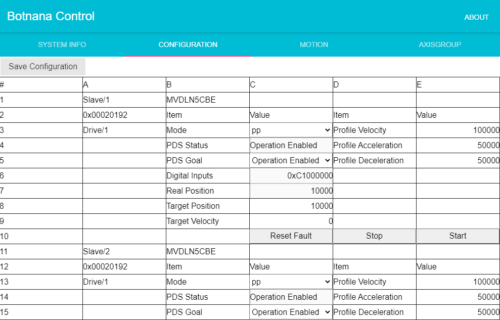

# 設定和測試 (Configuration)

## 系統資訊

## 從站參數設定及測試

### 驅動器 HM 模式設定及測試

### 驅動器 PP 模式設定及測試

### 驅動器 PV 模式設定及測試

### 驅動器 TQ 模式設定及測試

### 驅動器 CSP 模式設定及測試

### 驅動器 CSV 模式設定及測試

### 驅動器 CST 模式設定及測試

## 運動控制參數設定

## 軸組參數設定

## 版本、IP 位址、開關機及更新

