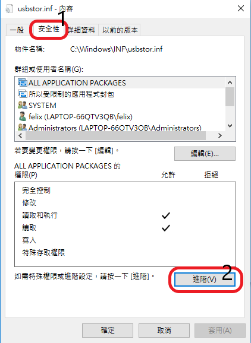
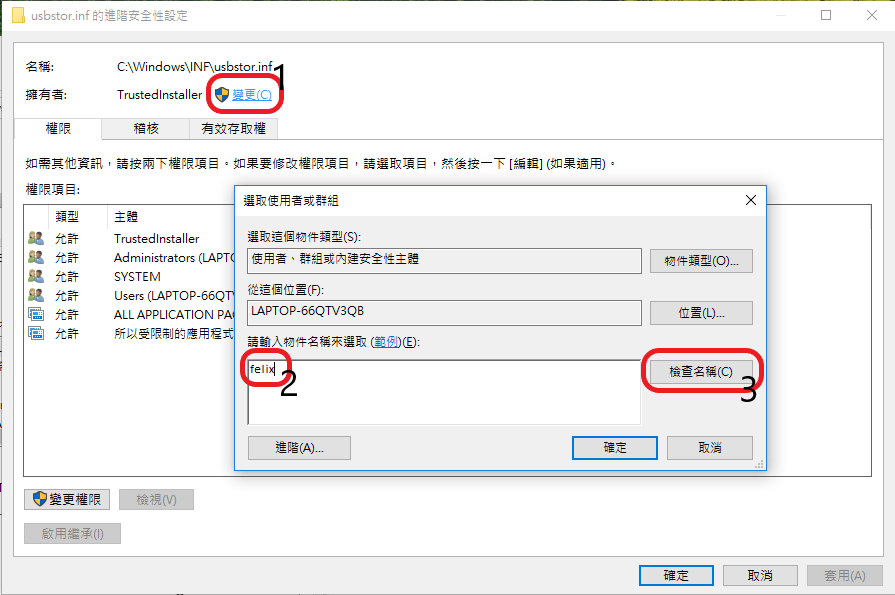
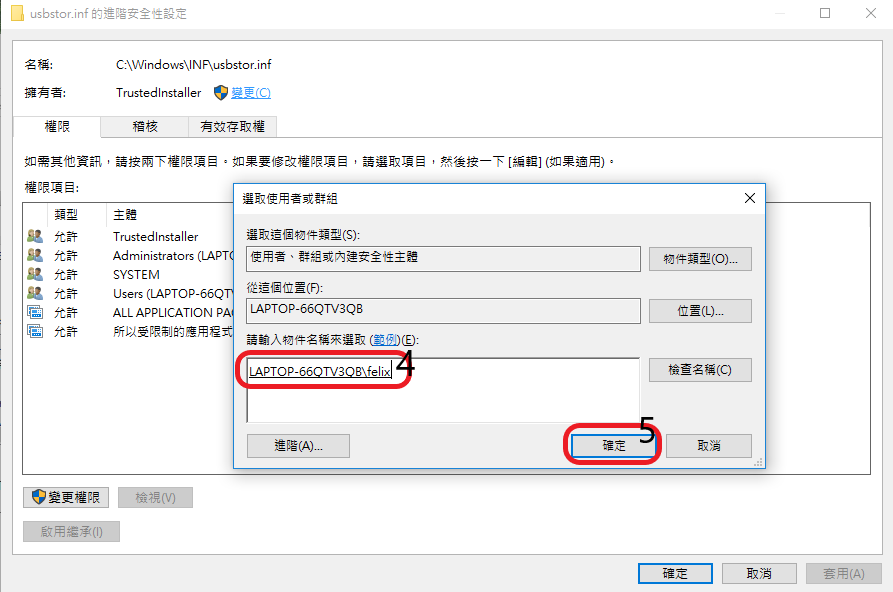
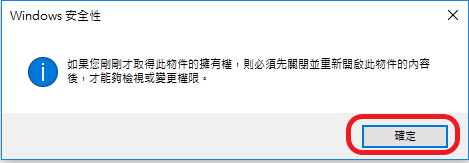
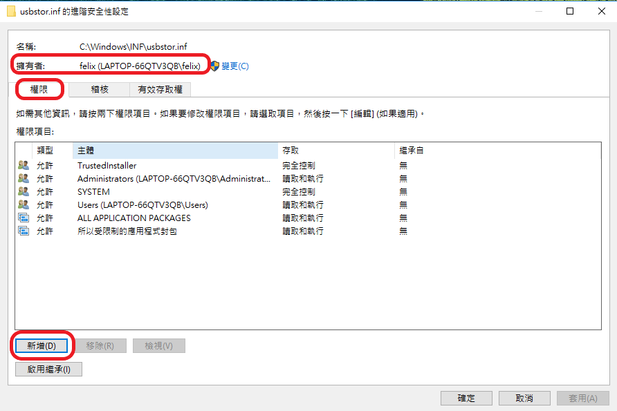
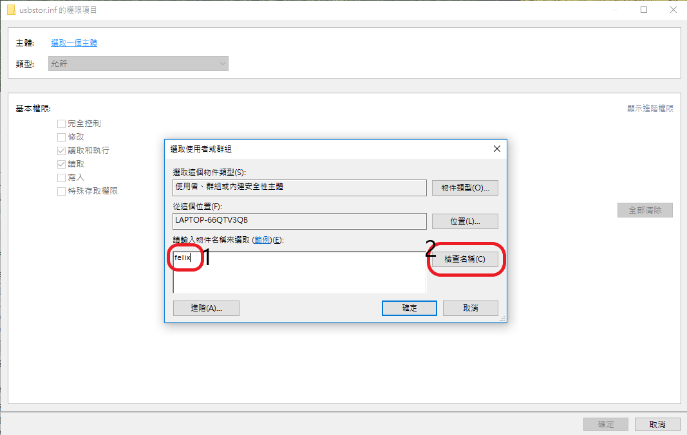
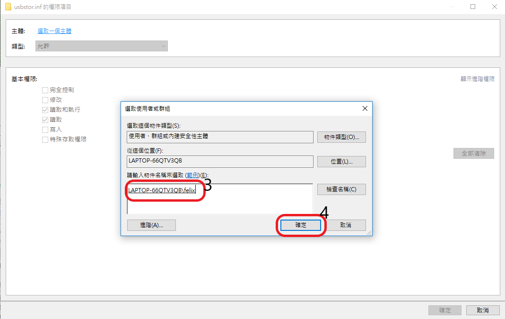
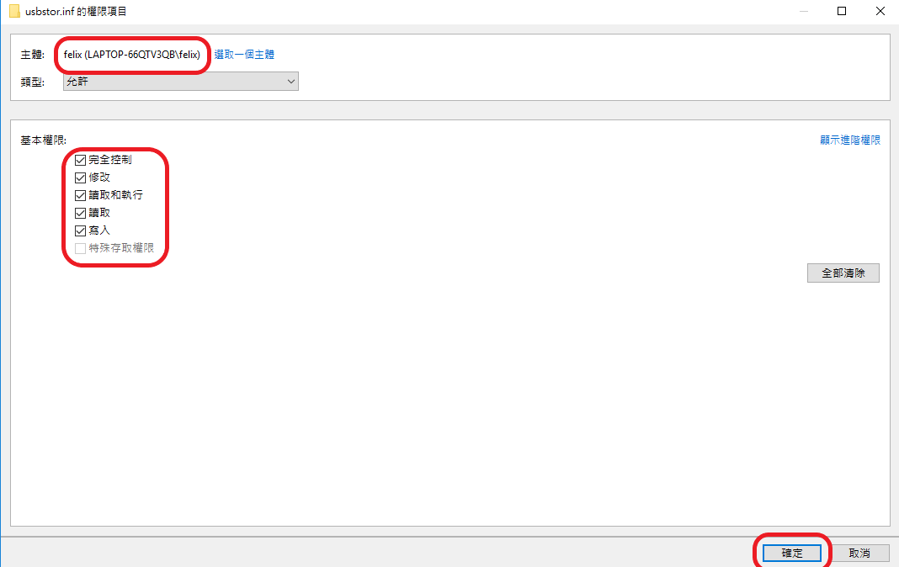
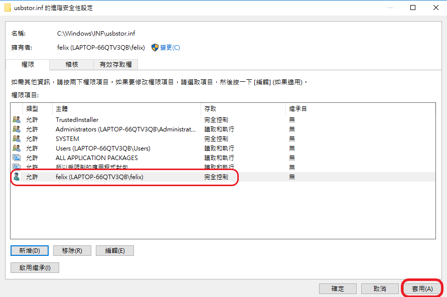
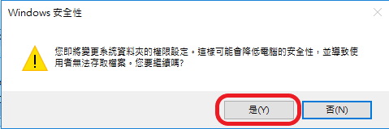

## 修改權限的步驟 ##
1. 以 C:\Windows\INF\usbstor.inf 檔案為範例
2. 假設登入 Windows 10 的使用者帳號為 felix

#### step 1. 將滑鼠移到 usbstor.inf 上，並按滑鼠右鍵，選 內容 。
#### step 2. 選 安全性 -〉 進階 。

#### step 3. 按 變更 擁有者，輸入使用者帳號，按 檢查名稱，此時會顯示完整的帳號資訊，按 確定 離開。

#### step 4. 回到上一層後，按 套用 ，顯示警告訊息，按 確定。

#### step 5. 將顯示 usbstor.inf 內容的視窗全部關閉後，再重開 內容 視窗。

#### step 6. 新增 一個主體。

#### step 7. 選取一個主體。

#### step 8. 輸入帳號並檢查名稱，再按確定。

#### step 9. 修改基本權限後，按確定。

#### step 10. 確認帳號已正確加入，並擁有完全控制的權限。

#### step 11. 按 套用及確定，顯示安全警告的訊息，按 是。

