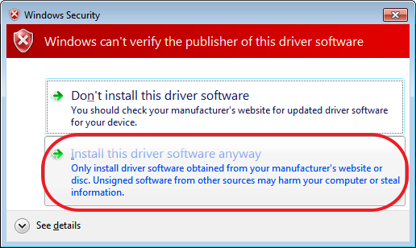

## WINDOWS 7 透過 MicroUSB 與 Botnana A2 連線時需先安裝 RNDIS 驅動程式

#### 1. 32 位元與 64 位元

都是用同一個安裝流程。

#### 2. 首先，先下載 `mapacode_botnana_a2.inf`

[按此連結下載 mapacode_botnana_a2.inf](./mapacode_botnana_a2.inf)

此設定檔是由 [MicroSoft Remote NDIS INF Template](https://docs.microsoft.com/en-us/windows-hardware/drivers/network/remote-ndis-inf-template)
修改而成。

#### 3. 將電腦 Botnana A2 的 MicroUSB 埠與電腦的 USB 埠使用 USB 線材連結。

到 Windows 裝置管理員 （Device Manager）畫面，應可以看到 Botnana-A2 裝置出現。

#### 4. 選擇 Botnana-A2 裝置更新驅動程式

點選 Botnana-A2 裝置，按下滑鼠右鍵，進行驅動程式更新。

#### 5. 瀏覽電腦上的驅動程式軟體

 
 
#### 6. 讓我從電腦上的裝置驅動程式清單中挑選

#### 7. 請從下列清單中選取你裝置的類型，選擇[網路介面卡]

#### 8. 選擇從磁片安裝

#### 9. 選擇 `mapacode_botnana_a2.inf` 所在的目錄位置

此範例的 `mapacode_botnana_a2.inf` 的目錄位置是 D:\rndis

#### 10. 此時相容的網路介面卡會出現 [Botnana-A2]

按下 [Next]，繼續安裝。

#### 11. 選擇 [仍然安裝此驅動程式軟體]

#### 12. 等候安裝完成

#### 13. 安裝完成

#### 14. 可以由以下步驟確認 Botnana-A2 的裝置狀態

##### 14.1. 網路介面卡裝置出現 [Botnana-a2]

##### 14.2 在[控制台]->[網路與網際網路]->[網路和共用中心]會出現 Botnana-A2 的網路裝置

##### 14.3. 查看 Botnana-A2 的裝置狀態

使用滑鼠游標移至 Botnana-A2 網路裝置，按下滑鼠右鍵，選擇[狀態]，就會出現以下視窗。

##### 14.4. 查看 Botnana-A2 的詳細資料

以此範例可以看到本機的IP 是 192.168.7.1。而 DHCP Server IP 是 192.168.7.2，此 DHCP Server IP 就是 Botnana-A2 的 IP。

