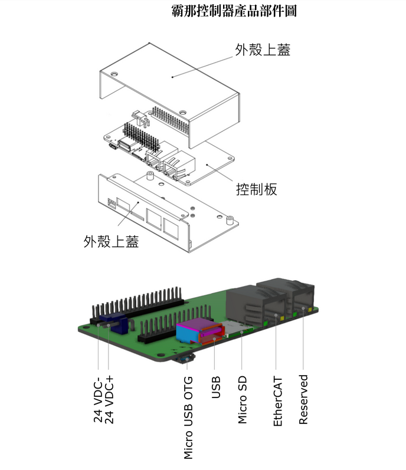
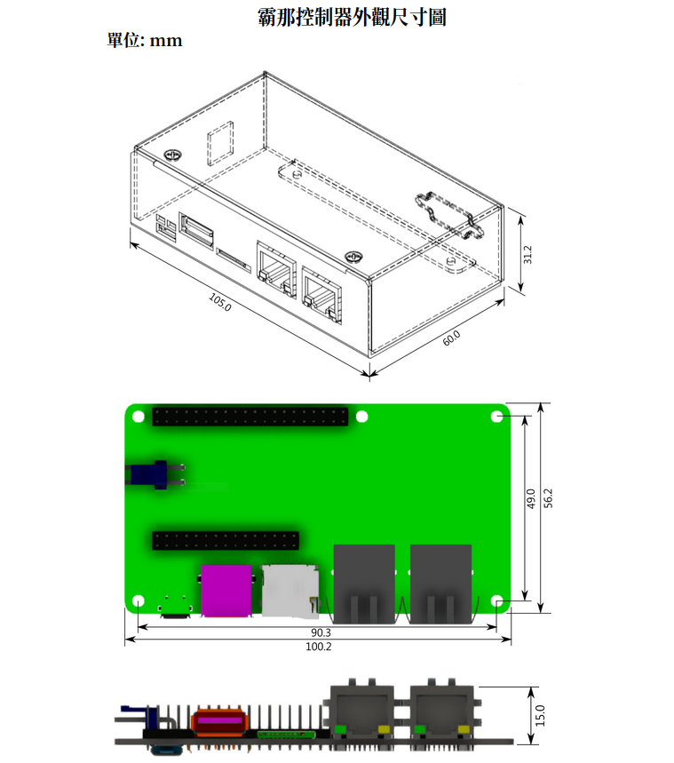
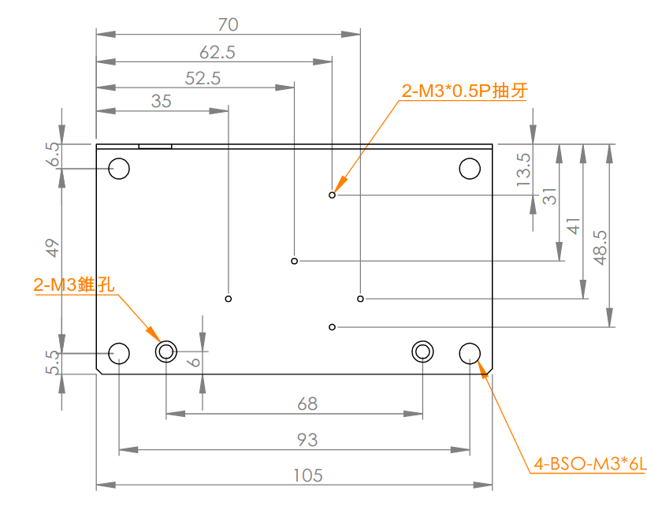

# 安裝 (Installation)

請參考本章後方的部件圖、尺寸圖和固定孔圖。

## 固定

請參考固定孔圖。在外殼下蓋上有五個孔可以做為固定孔。透過固定孔可以將 Botnana B2A 以水平或垂直的方式固定於一背板或鋁軌固定片上。

## 配線

### 供電

請參考部件圖。Botnana B2A 最大消耗功率為 3.6 瓦。可透過 micro USB 以 5V/0.7A 供電或是透過 VH3.96mm P2 接口以 24V/0.15A 供電。VH3.96 接口也可以使用 6.9V-34V 範圍的其他直流電壓供電，請自行計算所需電流。

注意當有上位工業電腦時，上位電腦是透過 micro USB 和 Botnana B2A 通訊。如果此時 VH3.96mm P2 接口未接直流電源，則會由上位電腦的 USB 供電給 Botnana B2A。如果於此同時 VH3.96mm P2 接口接了 24V 電源，則會由此一 24V 電源供電。

### 接地

請參考固定孔圖，透過固定孔所連結的背板或鋁軌將外殼接地。

### 上位電腦

Botnana B2A 透過 micro USB OTG 模擬的 Ethernet 接口連絡上位的工業電腦。出廠的 Ethernet IP 位址是 192.168.7.2。在 Botnana B2A 側使用了以下三種伺服器和上位電腦通訊。

* HTTP 伺服器。提供網頁。預設網址為 http://192.168.7.2:3000。
* Websocket 伺服器。預設網址為 ws://192.168.7.2:3012。提供比 HTTP 更有效率的全雙工 TCP 通訊。用於下命令給 EtherCAT 主站。命令的協定請見 Botnana Control 程式手冊。
* SSH 伺服器。預設網址為 ssh://192.168.7.2:22。上位電腦可以以 SSH 客戶端透過此一 SSH 伺服器進入 Botnana B2A 的 Linux 系統。登入的使用者名稱是 debian，密碼是 temppwd。若上位系統為 Linux 系統，可以使用 `ssh debian@192.168.7.2` 登入。

若上位系統為 Linux，不需特別處理就連上以上三個伺服器。若上位系統為 Windows，必須依本手冊後的常見問題中的說明對系統進行修改，才能以 Windows 的內建 RNDIS 驅動程式識別出 Botnana B2A。

### EtherCAT 從站

透過兩個網路接口中靠近 micro SD 的那個接口連接第一顆 EtherCAT 從站。而另一個接口目前不使用。請勿接 EtherCAT 從站或 Ethernet。

## 部件圖

## 尺寸圖

## 固定孔

